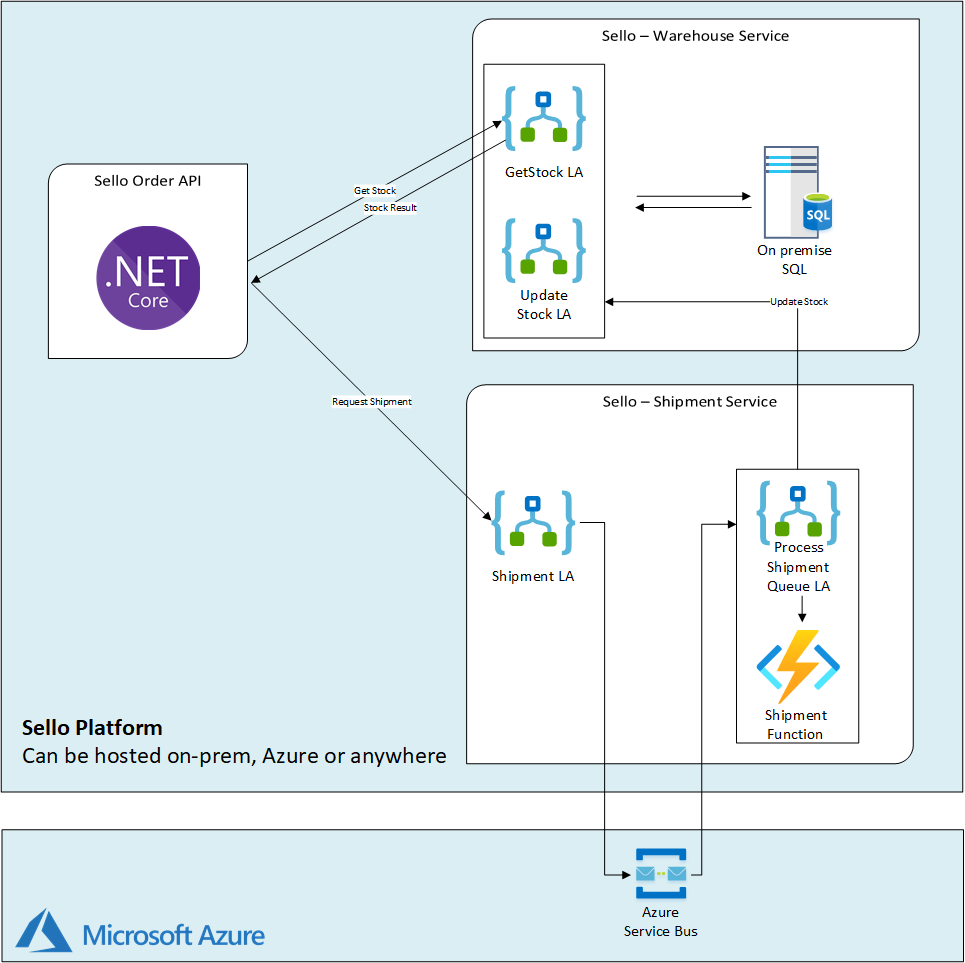

# Sello E-Commerce Platform - Running Logic Apps Anywhere

## Scenario
Sello provides an e-commerce platform allowing their customers to purchase products from the catalog and initiate shipments to their homes.

They are planning on going to the cloud but unfortunately depend on legacy systems, such as a SQL Server database, and decided to use a multi-phase migration.

As part of their application modernization, Sello wants to run cloud-native application on-premises to be ready when they migrate to the cloud. By packaging their apps as containers and run them on Kubernetes on-premises in order to connect to their legacy systems such as SQL Server.

Their landscape contains the following components:
-	An **Order service** where customers can create an order
    - This exposes a REST endpoint which is served by a .NET Core Web API. Every order request will check the warehouse service to see if the order is available and initiate a shipment
-	A **Warehouse service** to manage the stock of products that are available
    - Provides REST endpoint to verify stock of a product and update it once shipments are initiated. All stock information is stored in an on-premises SQL database.
-	A **Shipment service** to initiate shipments for orders
    - Provides a REST endpoint to accept new shipment requests which will be handled asynchronously



## How to run it?

### Build the different services as docker Images

```shell
❯ docker build --tag sello-orderservice -f Sello.OrderService/Dockerfile --no-cache .

❯ docker build --tag sello-warehouseservice -f Sello.WarehouseService/Dockerfile --no-cache .

❯ docker build --tag sello-shipmentservice -f Sello.ShipmentService/Dockerfile -no-cache .
```

### Local SQL DB

Create a product table in a (local) sql server

```sql
CREATE TABLE [dbo].[Product](
	[Id] [int] IDENTITY(1,1) NOT NULL,
	[Description] [varchar](500) NOT NULL,
	[Stock] [int] NOT NULL)
```

### Run the WarehouseService Docker image:

```shell
❯ docker run -d -p 5002:80 -e "AzureWebJobsStorage=<connection-string>" -e "sql-connectionString=<local-sql-connection-string>" sello-warehouseservice
```

Get the callback URL for GetStock Logic App via cURL:
```shell
❯ curl --location --request POST 'http://localhost:5002/runtime/webhooks/flow/api/management/workflows/GetStock/triggers/manual/listCallbackUrl?api-version=2019-10-01-edge-preview&code=<key>' --header "Content-Length: 0"
{
  "value": "https://localhost:443/api/GetStock/triggers/manual/invoke?api-version=2020-05-01-preview&sp=%2Ftriggers%2Fmanual%2Frun&sv=1.0&sig=<sig>",
  "method": "POST",
  "basePath": "https://localhost/api/GetStock/triggers/manual/invoke",
  "queries": {
    "api-version": "2020-05-01-preview",
    "sp": "/triggers/manual/run",
    "sv": "1.0",
    "sig": "<sig>"
  }
}

IMPORTANT: When using those trigger url's, don't forget to change the url for using in your docker container. 

Get the callback URL for UpdateStock Logic App  via cURL:
```shell
❯ curl --location --request POST 'http://localhost:5002/runtime/webhooks/flow/api/management/workflows/UpdateStock/triggers/manual/listCallbackUrl?api-version=2019-10-01-edge-preview&code=<key>' --header "Content-Length: 0"
{
  "value": "https://localhost:443/api/UpdateStock/triggers/manual/invoke?api-version=2020-05-01-preview&sp=%2Ftriggers%2Fmanual%2Frun&sv=1.0&sig=<sig>",
  "method": "POST",
  "basePath": "https://localhost/api/UpdateStock/triggers/manual/invoke",
  "queries": {
    "api-version": "2020-05-01-preview",
    "sp": "/triggers/manual/run",
    "sv": "1.0",
    "sig": "<sig>"
  }
}
```

### Run the ShipmentService Docker image:

```shell
❯ docker run -d -p 5001:80 -e "AzureWebJobsStorage=<connection-string>" -e "servicebus-connectionString=<servicebus-connection-string>" -e "warehouse_setstockurl=<url-of-updatestock-logicapp>"  sello-shipmentservice
```

Get the callback URL for ShipmentQueue Logic App  via cURL:
```shell
❯ curl --location --request POST 'http://localhost:5001/runtime/webhooks/flow/api/management/workflows/ShipmentQueue/triggers/manual/listCallbackUrl?api-version=2019-10-01-edge-preview&code=<key>' --header "Content-Length: 0"
{
  "value": "https://localhost:443/api/ShipmentQueue/triggers/manual/invoke?api-version=2020-05-01-preview&sp=%2Ftriggers%2Fmanual%2Frun&sv=1.0&sig=<sig>",
  "method": "POST",
  "basePath": "https://localhost/api/ShipmentQueue/triggers/manual/invoke",
  "queries": {
    "api-version": "2020-05-01-preview",
    "sp": "/triggers/manual/run",
    "sv": "1.0",
    "sig": "<sig>"
  }
}
```

### Run the Order API Docker image:

```shell
❯ docker run -d -p 5000:80 -e "ShipmentService=<url-of-shipmentqueue-logicapp>" -e "StockService=<url-of-getstock-logicapp>" sello-orderservice
```

### Create an order

Order Example
```json
{
    "OrderNr":"ord_001",
    "OrderDate":"2020-08-20",
    "Customer":{
        "Email":"customer@codit.eu",
        "Name":"Codit"
    },
    "OrderItems":[
        {
            "OrderLineNr":1,
            "ItemId":1,
            "Qty":2
        }
    ]
}
```

```shell
❯ curl --location --request POST --data <orderjson> 'http://localhost:5000/api/v1/order' --header "Content-Type: application/json" --header "X-API_KEY=<apikey>"
```
